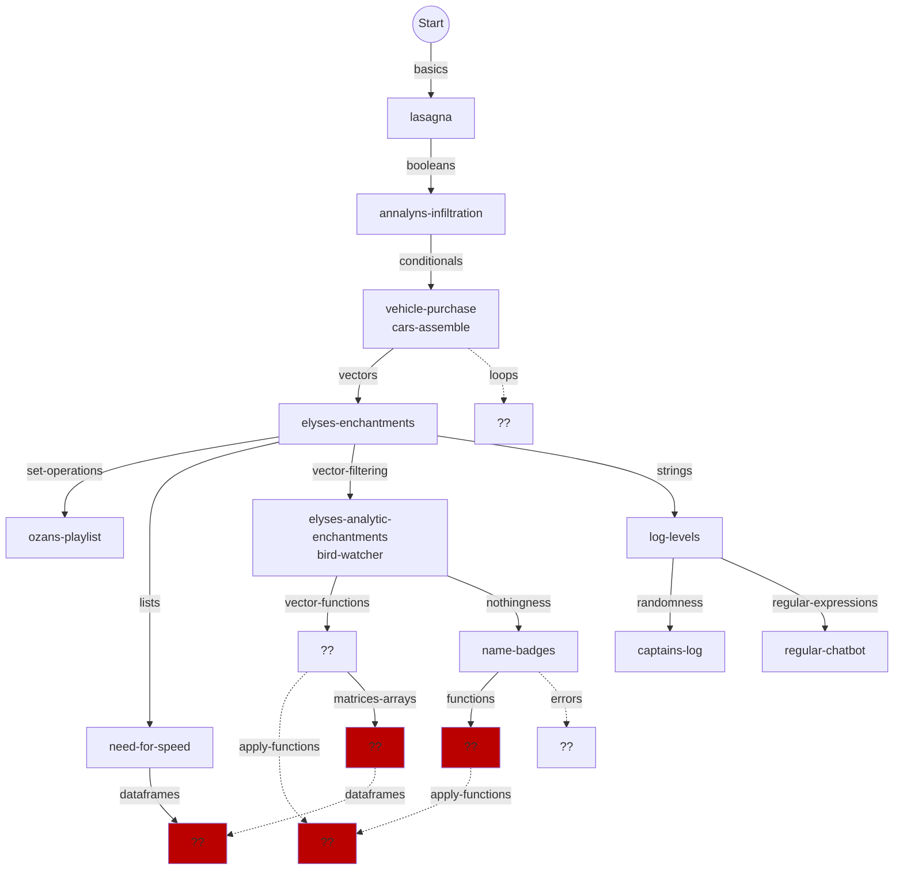
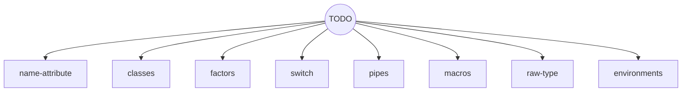

# Concept tree for R learning mode

## Some that are already in progress or planned

This is a very fluid plan and will doubtless continue to change frequently!

Boxes in red will almost certainly need a new concept exercise created. 
Others marked `??` can probably fork something suitable from other tracks (TODO).

This isn't quite as tangled as it may appear. I guess Mermaid doesn't have great algorithms for preventing arrows crossing, and I don't know it well enough to take manual control.

## Some future concepts to be slotted in

