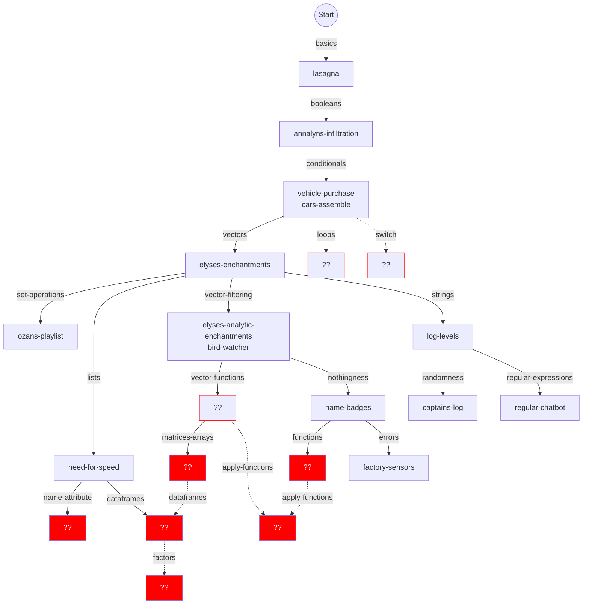
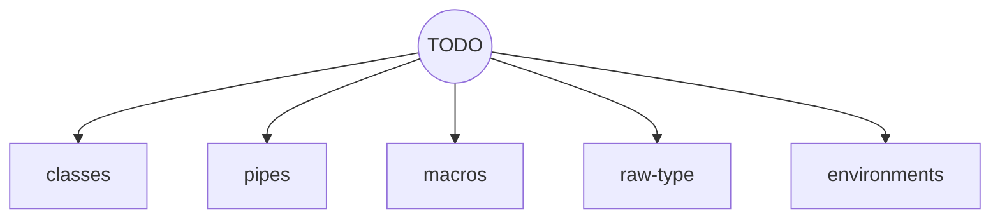

# Concept tree for R learning mode

## Some that are already in progress or planned

This is a very fluid plan and will doubtless continue to change frequently!

Boxes in solid red will almost certainly need a new concept exercise created. 
Others marked `??` with red borders can probably fork something suitable from other tracks (TODO).

This isn't quite as tangled as it may appear.

## Some future concepts to be slotted in

