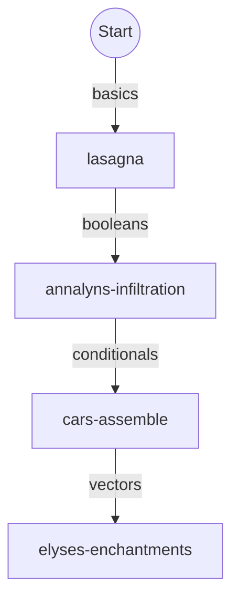

# Concept tree for R

```mermaid
graph TD

start(("Start")) --basics--> basics["lasagna"]
basics["lasagna"] --booleans--> booleans["annalyns-infiltration"]
booleans --conditionals--> conditionals["cars-assemble"]
conditionals["cars-assemble"] --vectors--> vectors["elyses-enchantments"]
```