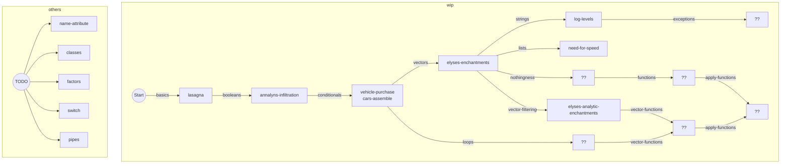

# Concept tree for R learning mode

```mermaid
graph TD
    
subgraph wip
    start(("Start")) --basics--> basics["lasagna"]
    basics --booleans--> booleans["annalyns-infiltration"]
    booleans --conditionals--> conditionals["vehicle-purchase<br/>cars-assemble"]
    conditionals --vectors--> vectors["elyses-enchantments"]
    conditionals --loops--> loops["??"]
    vectors --lists--> lists["need-for-speed"]
    vectors --vector-filtering--> vector-filtering["elyses-analytic-enchantments"]
    vectors --nothingness--> nothingness["??"]
    vectors --strings--> strings["log-levels"]
    strings --exceptions---> exceptions["??"]
    vector-filtering --vector-functions--> vector-functions["??"]
    loops --vector-functions--> vector-functions["??"]
    nothingness --functions--> functions["??"]
    functions --apply-functions--> apply-functions["??"]
    vector-functions --apply-functions--> apply-functions["??"]
    end

subgraph others
    todo(("TODO")) --> name-attribute
    todo(("TODO")) --> classes
    todo(("TODO")) --> factors 
    todo(("TODO")) --> switch
    todo(("TODO")) --> pipes
end
```