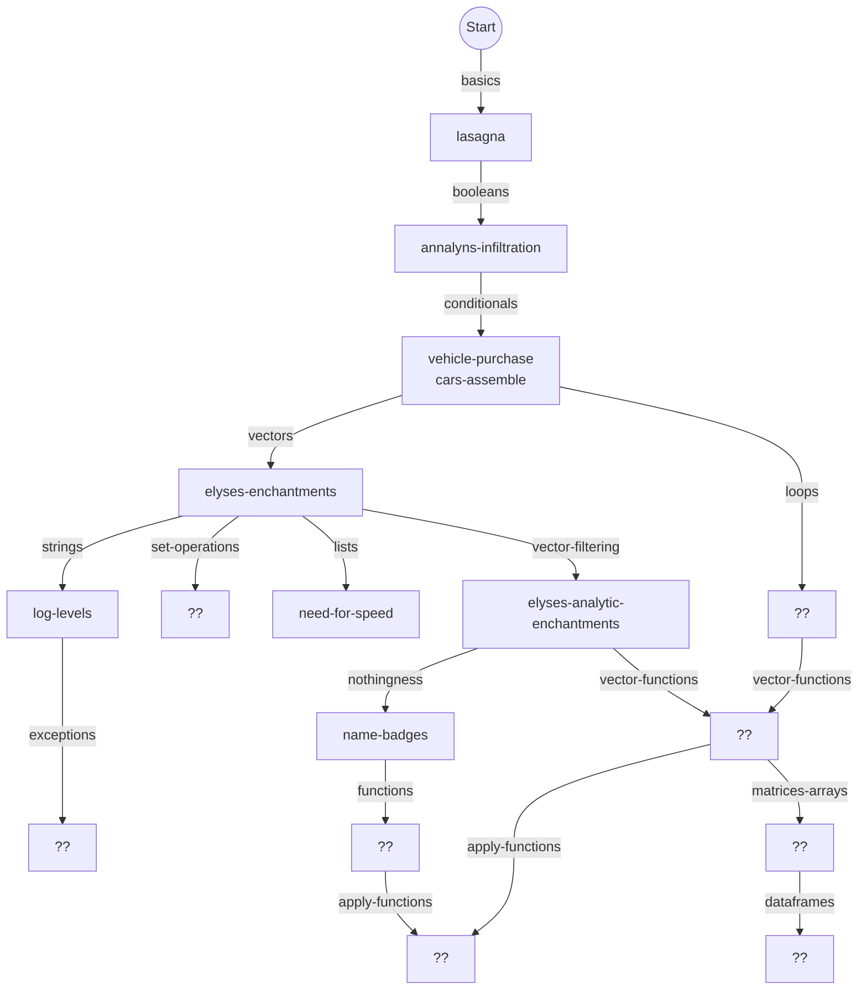
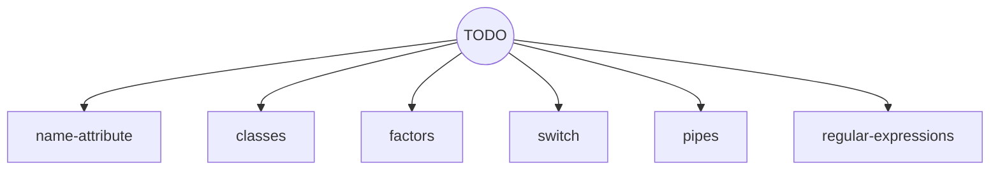

# Concept tree for R learning mode

## Some that are already in progress or planned

```mermaid
graph TD
    
start(("Start")) --basics--> basics["lasagna"]
basics --booleans--> booleans["annalyns-infiltration"]
booleans --conditionals--> conditionals["vehicle-purchase<br/>cars-assemble"]
conditionals --vectors--> vectors["elyses-enchantments"]
conditionals --loops--> loops["??"]
vectors --set-operations--> set-operations["??"]
vectors --lists--> lists["need-for-speed"]
vectors --vector-filtering--> vector-filtering["elyses-analytic-enchantments"]
vector-filtering --nothingness--> nothingness["name-badges"]
vectors --strings--> strings["log-levels"]
strings --exceptions---> exceptions["??"]
vector-filtering --vector-functions--> vector-functions["??"]
loops --vector-functions--> vector-functions["??"]
nothingness --functions--> functions["??"]
functions --apply-functions--> apply-functions["??"]
vector-functions --apply-functions--> apply-functions["??"]
vector-functions --matrices-arrays--> matrices-arrays["??"]
matrices-arrays --dataframes--> dataframes["??"]
```

## Some future concepts to be slotted in

```mermaid
graph TD
    
todo(("TODO")) --> name-attribute
todo --> classes
todo --> factors 
todo --> switch
todo --> pipes
todo --> regular-expressions
```